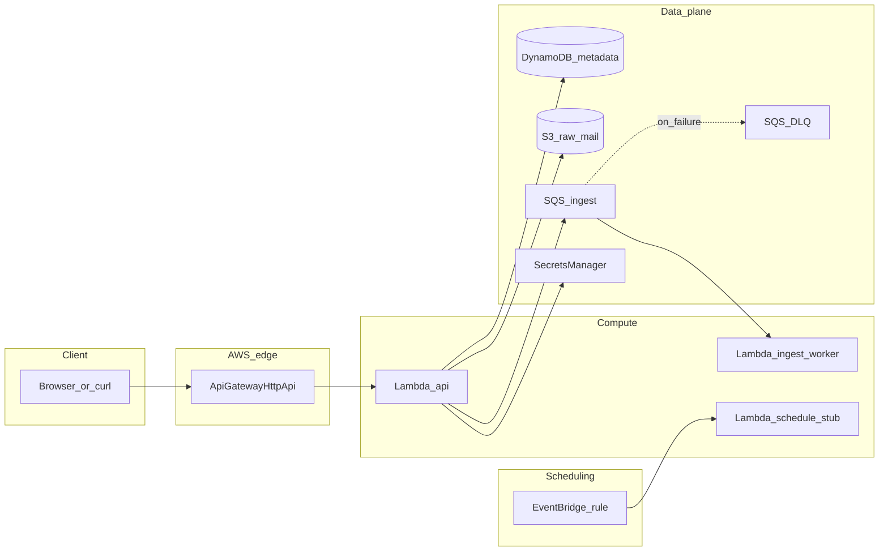

# Architecture (MailManager infrastructure)

This document describes the **AWS architecture provisioned by Terraform** for the MailManager email-RAG SaaS prototype. Application features (OAuth flows, chunking, Bedrock prompts) are **out of scope** for the Terraform module beyond hooks (queues, secrets, schedules).

## High-level diagram

## Components

| Component | Purpose |
|-----------|---------|
| **API Gateway HTTP API** | Public HTTPS endpoint; `GET /health` today; future REST-style routes for the web app. |
| **Lambda (API)** | Handles HTTP via proxy integration; demonstrates DynamoDB and documents S3/Secrets/SQS IAM for future routes. |
| **DynamoDB** | Generic `PK`/`SK` table for users, linked accounts, sync cursors—**schema evolves in application code**. |
| **S3** | Raw MIME / exports / attachments for ingestion pipelines. |
| **SQS + DLQ** | Async ingestion work; DLQ captures poison messages after redrive attempts. |
| **Lambda (ingest worker)** | Processes SQS messages (stub: log + delete). Replace body with real parsers/embedders later. |
| **Secrets Manager** | Placeholders for OAuth client secrets and similar—**values set outside git** after apply. |
| **EventBridge** | Optional schedule (default **disabled**) calling a **stub** Lambda to simulate periodic sync. |
| **CloudWatch Logs** | Per-Lambda log groups for operator verification. |

## What is **not** in AWS Terraform (external)

- **Google Cloud** project for Gmail API OAuth consent and credentials.
- **Microsoft Entra (Azure AD)** app registration for Microsoft Graph.
- **Amazon Bedrock model access** (often enabled in AWS Console per account/region). IAM policies for `bedrock:InvokeModel` may be added later alongside application code.

## Region and naming

- Default region is configurable via `aws_region` (see [`infra/terraform/examples/demo.tfvars`](../infra/terraform/examples/demo.tfvars)).
- S3 bucket names use a **random suffix** to reduce collisions.

## Future: Bedrock and RDS pgvector

See [future-bedrock-rds.md](future-bedrock-rds.md) for prerequisites, suggested Terraform/IAM shape, and manual tests when you add those capabilities.

See also [phases.md](phases.md) Phase 4+.
