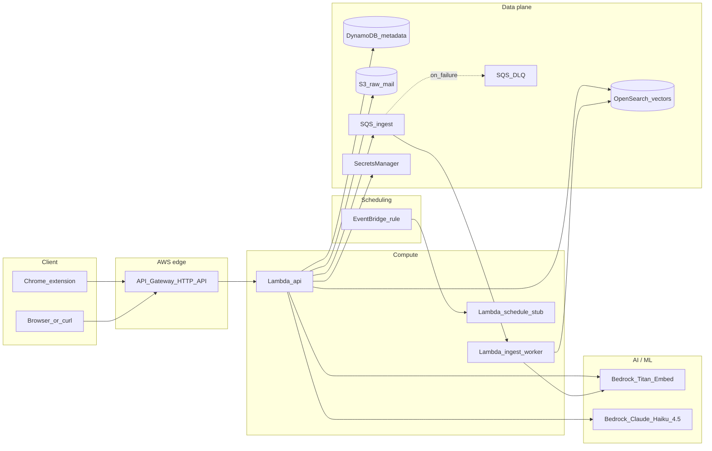

# Architecture (MailManager)

AWS infrastructure provisioned by Terraform, plus the Chrome extension that drives it.

## High-level diagram



## Components

| Component | Purpose |
|-----------|---------|
| **Chrome extension** | Gmail content script; injects "Generate AI Reply" button; reads thread DOM; dispatches to service worker; renders reply modal. |
| **API Gateway HTTP API** | Public HTTPS endpoint; proxy-integrates every route to the API Lambda. |
| **Lambda (api)** | All HTTP routes: `/health`, `/mailboxes`, `/threads`, `/threads/{id}`, `/threads/{id}/summary`, `/threads/{id}/draft-reply`, `/threads/{id}/action-items`, `/ingest/demo`, `/enqueue`, `/reply` (RAG), `/search` (semantic), `/admin/setup-index`. |
| **Lambda (ingest worker)** | SQS-triggered; reads raw email JSON from S3; calls Bedrock Titan Embed per message; writes vector + metadata docs to OpenSearch. |
| **Lambda (schedule stub)** | EventBridge target; placeholder for future periodic mailbox sync. |
| **DynamoDB** | Single-table store (`PK`/`SK`); holds `MailboxConnection`, `EmailThread`, and `EmailMessage` records. |
| **S3 (raw mail)** | Stores raw email JSON dumps (e.g. `demo/demo_emails.json`); `_healthcheck/last.json` written on every `/health` call. |
| **SQS + DLQ** | Decouples ingest trigger from vectorization worker; DLQ captures messages that fail all redrive attempts. |
| **OpenSearch Service** | k-NN vector index (`mailmanager-index`); stores 1536-dim Titan embeddings per message; serves approximate nearest-neighbor queries for RAG retrieval. |
| **Bedrock — Titan Embed Text v1** | Embedding model (`amazon.titan-embed-text-v1`); converts email text to 1536-dim vectors at ingest and at query time. |
| **Bedrock — Claude Haiku 4.5** | Generation model (cross-region inference profile `us.anthropic.claude-haiku-4-5-20251001-v1:0`); produces reply drafts, thread summaries, action-item extractions, and semantic search answers. |
| **Secrets Manager** | Holds OAuth client secrets and similar credentials; values set outside git after `terraform apply`. |
| **EventBridge** | Scheduled rule (disabled by default) that fires the schedule-stub Lambda. |
| **CloudWatch Logs** | Per-Lambda log groups; retention configured by Terraform. |

## RAG pipeline (`/reply` and `/search`)

```
Chrome extension sends { subject, bodyText, threadHistory, tone }
  │
  ▼
API Lambda: embed (subject + bodyText) via Bedrock Titan Embed → 1536-dim vector
  │
  ▼
API Lambda: k-NN search against OpenSearch (k=3) → top-3 similar emails
  │
  ▼
API Lambda: build prompt
  ┌─────────────────────────────────────────────────────┐
  │ System: draft a reply on behalf of the user         │
  │ Thread history: [msg-1 … msg-n]                     │
  │ Relevant inbox context: Source 1 … Source 3         │
  │ Email to reply to: From / Subject / Body            │
  │ Tone: professional | casual | brief                 │
  └─────────────────────────────────────────────────────┘
  │
  ▼
API Lambda: invoke Bedrock Claude Haiku 4.5
  │
  ▼
Return { replyText, modelUsed, retrievedCount, retrievalMode }
```

Fallback chain if OpenSearch is unavailable: DynamoDB keyword scan → Bedrock.  
Fallback if Bedrock fails: hardcoded template reply. The button never returns blank.

## Ingest pipeline (SQS → worker)

```
POST /ingest/demo  (or POST /enqueue with a custom payload)
  │  writes demo_emails.json to S3 and enqueues { bucket, key }
  ▼
SQS ingest queue → Lambda worker
  │
  ▼
Worker: GET object from S3 → iterate threads → iterate messages
  │  for each message: embed text via Bedrock Titan Embed
  ▼
Worker: PUT /<index>/_doc/<messageId> into OpenSearch (SigV4-signed)
```

35 demo messages are indexed on a fresh deploy (confirmed via worker logs: "Indexed 35 messages total").

## External dependencies (not managed by this Terraform module)

- **Google Cloud** — Gmail API OAuth consent screen and credentials.
- **Microsoft Entra (Azure AD)** — Microsoft Graph app registration.
- **Bedrock model access** — must be enabled per account/region in the AWS Console before `terraform apply`.

## Region and naming

- Default region: `us-east-1` (configurable via `aws_region` in `infra/terraform/examples/demo.tfvars`).
- S3 bucket names include a random suffix to avoid global collisions.
- OpenSearch domain: `mailmanager-vectors`; index: `mailmanager-index`.
